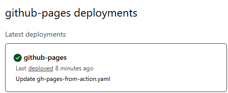

# Building an automation pipeline.
In this repo I will take you through all the steps required to setup your own automation pipeline. 

## Creating an app
For the purposes of this example project we will create a basic app that consists of three files. 

* index.html
* style.css
* script.js

To keep things nice and simple the app will provide a button, and when clicked, will output the data and time.

## How to run the app locally
To run the app locally we will use Docker.

### Create a Dockerfile
Inside your project folder, create a new file named Dockerfile:

```dockerfile
# Use an official Nginx image as the base
FROM nginx:alpine

# Copy the website files into the Nginx default directory
COPY . /usr/share/nginx/html

# Expose port 80
EXPOSE 80

# Start Nginx
CMD ["nginx", "-g", "daemon off;"]
```

### Build the Docker Image
Run the following command in the terminal inside your project folder:
```docker build -t mywebsite .```
This creates a Docker image named mywebsite.

### Run the Container
Now, start the container and expose it on port 8080:

```docker run -d -p 8080:80 mywebsite```
* The -d flag runs the container in the background.

* -p 8080:80 maps port 80 in the container to port 8080 on your machine.

### Access Your Website
Open your browser and go to:

```http://localhost:8080```

Your website should be running!

### Optional Improvement
To simplify the Docker build and run commands we can configure 'scripts' in a package.json file like this: 

```JSON
  "scripts": {
    "docker:build": "docker build -t my-site .",
    "docker:run": "docker run -d -p 8080:80 my-site"
  },
```
The package.json file lives in the root directory and the commands are then triggered from the terminal using:

```npm run docker:build```
and 
```npm run docker:run```

## Deploying the app
Deployment is configured in GitHub using the 'deploy from action' option. 
This can be set in /settings/pages.


The workflow is then built using the following GitHub Actions:
https://github.com/actions/deploy-pages
https://github.com/actions/upload-pages-artifact

The final YAML should look like this:

```yaml
name: GitHub Pages From Action

on:
  workflow_dispatch:
  
jobs:
  build:
    runs-on: ubuntu-latest
    steps:
      - name: Checkout repository
        uses: actions/checkout@v4

      - name: Upload static files as artifact
        uses: actions/upload-pages-artifact@v3
        with:
          path: src/

  deploy:
    environment:
      name: github-pages
      url: ${{ steps.deployment.outputs.page_url }}
      
    runs-on: ubuntu-latest
    
    permissions:
      contents: read  # Allows reading repository contents
      pages: write    # Allows publishing to GitHub Pages
      id-token: write # Required for authentication
      
    needs: build
    steps:
      - name: Deploy to GitHub Pages
        uses: actions/deploy-pages@v4
```

When triggered you should see a success message in /deployments/github-pages.



## Cypress tests
I've created a test suite using Cypress to run some basic assertions against the app. 

### Workflow to trigger tests locally
https://github.com/w4dd325/automated-pipeline/blob/main/.github/workflows/cypress-tests.yaml

### Workflow to trigger tests post-deployment


